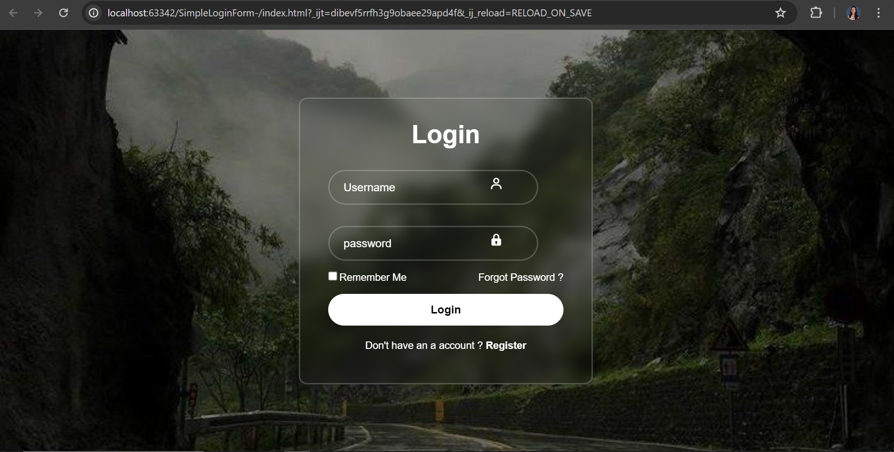

# SimpleLoginForm-
Simple Login Form Using HTML and CSS
# Simple Transparent Login Form

This repository contains a simple and stylish login form created using HTML and CSS. The form features a transparent login box design that is visually appealing and user-friendly.

## Demo



## Features

- Transparent login box
- Clean and modern design
- Responsive layout
- Easy to customize

## Technologies Used

- HTML5
- CSS3

## Getting Started

To get a local copy up and running follow these simple steps.

### Prerequisites

Make sure you have a web browser installed (e.g., Google Chrome, Mozilla Firefox).

### Installation

1. Clone the repo

```bash
git clone https://github.com/powar02vaishnavi/SimpleLoginForm-.git

Usage
The login form can be used as a starting point for your web projects. You can integrate it into your existing website or modify the styles to suit your needs.
